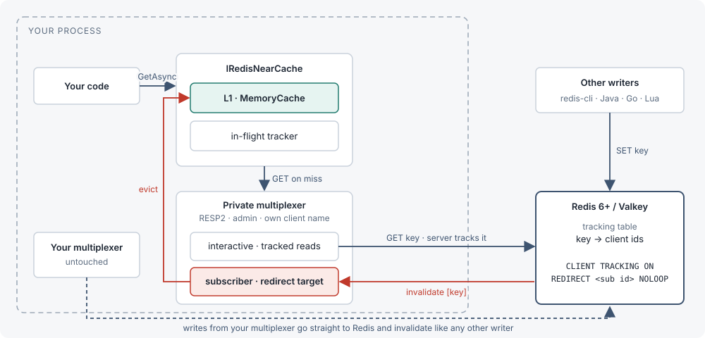
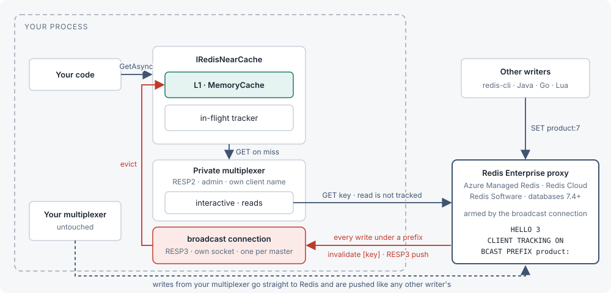

<div align="center">
  
  <h1>RedisNearCache</h1>
  <p><strong>Client-side caching on top of StackExchange.Redis. Keeps the values you read in memory and drops them the moment Redis says they changed.</strong></p>
  <p>
    <a href="https://github.com/magna-nz/redis-near-cache/actions/workflows/ci.yml"></a>
    <a href="https://www.nuget.org/packages/RedisNearCache"></a>
    <a href="https://dotnet.microsoft.com/"></a>
    <a href="https://redis.io/docs/latest/develop/clients/client-side-caching/"></a>
    <a href="LICENSE"></a>
  </p>
  <p>
    <a href="#redis-enterprise-azure-managed-redis-redis-cloud"></a>
    <a href="#redis-enterprise-azure-managed-redis-redis-cloud"></a>
    <a href="#redis-enterprise-azure-managed-redis-redis-cloud"></a>
  </p>
  <p><a href="https://magna-nz.github.io/redis-near-cache/">Documentation</a></p>
</div>

<br />

Redis 6 can tell a client when a key it has read changes (`CLIENT TRACKING`). RedisNearCache uses that to
keep a local copy of what you read: a hit is served from memory, and a write from anywhere evicts the copy a
few milliseconds later. It is a package you add next to StackExchange.Redis, not a replacement for it: your existing multiplexer
keeps doing everything it does today, and RedisNearCache opens one extra connection for the tracked reads.

Redis added this in version 6 back in 2020. StackExchange.Redis [never picked it up](https://github.com/StackExchange/StackExchange.Redis/issues/1461),
and the 3.x rewrite still ships without it. Rather than fork the library, RedisNearCache sits on top of it: a
second connection that it owns does the tracking, and your existing one keeps working exactly as before.

RedisNearCache is for code that already runs on StackExchange.Redis.

<div align="center">
  
  <br />
  <sub><strong>Only reads that go through the cache are tracked.</strong> Writes can come from anywhere.</sub>
  <br />
  <sub>This is the default <code>Redirect</code> mode. On Redis Enterprise-based services invalidations arrive over
  <a href="#redis-enterprise-azure-managed-redis-redis-cloud">Broadcast mode</a> instead.</sub>
</div>

<br />

More in the [documentation](https://magna-nz.github.io/redis-near-cache/), including the sequence diagrams,
the reconnect model and the API reference.

## Install

```sh
dotnet add package RedisNearCache
```

Add `RedisNearCache.HybridCache` as well if you want it behind `HybridCache` or `IDistributedCache`.

## Where it runs

| Platform | Mode | Tested |
|---|---|---|
| Redis 6+ (self-hosted, Docker, Kubernetes), Valkey | `Redirect` (default) | CI on Redis 6.2, 7.0, 7.2, 7.4, 8 and Valkey 8.1: standalone, replica, TLS, cluster, Sentinel. `Broadcast` also runs in the same jobs |
| Azure Managed Redis, Redis Cloud, Redis Software (databases 7.4+) | [`Broadcast`](#redis-enterprise-azure-managed-redis-redis-cloud), with `KeyPrefixes` set | CI against Redis Software in Docker (`enterprise-up.sh`, the same proxy those services run). Not yet run against a real Azure or Redis Cloud instance; `RNC_ENTERPRISE_REDIS` points the Enterprise suite at one |
| Azure Cache for Redis (Basic, Standard, Premium), node-based ElastiCache (Redis OSS, Valkey) | `Redirect` | Their restrictions (disabled admin commands, hostname-announcing cluster) are emulated in CI, not tested against the real services; `RNC_EXTERNAL_REDIS` runs a check against one |
| ElastiCache Serverless | Not supported | It disables `CLIENT TRACKING`, `CLIENT CACHING`, `CLIENT TRACKINGINFO`, `CLIENT LIST` and `CLIENT ID` |
| Garnet | Not supported | It does not implement `CLIENT TRACKING` |

## Use

Redis or Valkey reached directly (self-hosted, ElastiCache node-based, Azure Cache for Redis):

```csharp
services.AddRedisNearCache("localhost:6379");
```

Redis Enterprise-based services (Azure Managed Redis, Redis Cloud, Redis Software), whose proxy needs the
broadcast mode [described below](#redis-enterprise-azure-managed-redis-redis-cloud):

```csharp
services.AddRedisNearCache("my-cache.region.redis.azure.net:10000,ssl=true,password=<access-key>", o =>
{
    o.TrackingMode = TrackingMode.Broadcast;   // default is Redirect, for Redis reached directly
    o.KeyPrefixes.Add("user:");                 // invalidations are broadcast per prefix, so set one
});
```

Everything after registration is the same in both modes.

```csharp
var cache = provider.GetRequiredService<IRedisNearCache>();
await cache.Ready;                                     // subscription up, tracking armed on every master

var user = await cache.GetAsync<User>("user:42");      // miss: one GET, tracked, stored locally
var again = await cache.GetAsync<User>("user:42");     // hit: no network call

await cache.SetAsync("user:42", user with { Name = "Ada" });   // writes through, evicts the local copy
Console.WriteLine(cache.Statistics);                   // hits=1 misses=1 invalidations=0 flushes=0 rearms=0 raceDiscards=0
```

Then, from anywhere:

```sh
redis-cli SET user:42 '{"Name":"Grace"}'               # the next GetAsync sees Grace
```

Behind `HybridCache`:

```csharp
services.AddRedisNearCache("localhost:6379");
services.AddRedisNearCacheHybridCache();               // HybridCache's own L1 is disabled; ours is the coherent one
```

## Redis Enterprise, Azure Managed Redis, Redis Cloud

```csharp
services.AddRedisNearCache("my-cache.region.redis.azure.net:10000,ssl=true,password=<access-key>", o =>
{
    o.TrackingMode = TrackingMode.Broadcast;
    o.KeyPrefixes.Add("product:");
});
```

<div align="center">
  
  <br />
  <sub><strong>Broadcast mode.</strong> Every write under a prefix is pushed, whether or not this instance read the key.</sub>
</div>

The proxy in front of these Redis Enterprise-based services (databases 7.4+, the versions on which they support
client-side caching) rejects tracking on RESP2 and rejects `REDIRECT` under RESP3, and its `CLIENT LIST` does not
show our subscriber connection, so the default `Redirect` mode cannot arm there. `TrackingMode.Broadcast` opens
one small RESP3 connection of its own per master (same TLS and auth as the private multiplexer, client name
`<private client name>-bcast`) and arms it with `CLIENT TRACKING ON BCAST PREFIX <p>` for every entry of
`KeyPrefixes`, so it receives an invalidation push for every write or delete under those prefixes, whether or
not this instance holds the key; reads still go through the private multiplexer unchanged. If that connection
dies, the cache goes pass-through for that endpoint and re-arms on reconnect, flushing L1, exactly like `Redirect`
mode. Set `KeyPrefixes`: with none configured every write in the database is broadcast to this client. Invalidation
volume scales with the write rate under the prefixes rather than with what L1 holds, and the server's per-key
tracking table (subject to the Enterprise `tracking_table_max_keys` limit) is not used. If you register a custom
certificate validation callback, `Broadcast`'s own connection cannot see `ConfigurationOptions.CertificateValidation`;
supply it through `ConfigurationOptions.SslClientAuthenticationOptions` instead. `Broadcast` also works on OSS Redis 6+
and Valkey, but `Redirect` stays the default there since it only pushes for keys this instance actually read.

Entra ID authentication (`Microsoft.Azure.StackExchangeRedis`) works with `Broadcast`, including in-place
re-authentication of a live connection when the token rotates. Configure `ConfigurationOptions` with the
extension and pass it as `RedisNearCacheOptions.Configuration`:

```csharp
var cfg = ConfigurationOptions.Parse("my-cache.region.redis.azure.net:10000");
await cfg.ConfigureForAzureWithTokenCredentialAsync(new DefaultAzureCredential());   // Microsoft.Azure.StackExchangeRedis

services.AddRedisNearCache(o =>
{
    o.Configuration = cfg;
    o.TrackingMode = TrackingMode.Broadcast;
    o.KeyPrefixes.Add("product:");
});
```

RedisNearCache clones `cfg`, and the clone shares the extension's token provider: StackExchange.Redis resolves
`User`/`Password` through `ConfigurationOptions.Defaults`, which `Clone()` copies by reference. The private
multiplexer is created from that same provider, so the extension registers it through its `AfterConnectAsync` hook (verified
for a clone-built multiplexer) and re-authenticates it exactly as it does any multiplexer it manages; every broadcast connection reads the current object id and token when it connects; and a live
broadcast connection compares its current credentials against the provider on every keepalive tick (10 s, up to about 15 s if a `PING` is in flight),
re-authenticating in place with `AUTH <objectId> <token>` when they changed — no `TrackingLost`, no L1 flush. If the server rejects the rotated credential, the connection keeps the one it has (a failed `AUTH` leaves a Redis
connection's authentication unchanged) and stays armed; the rotation is retried as soon as the provider yields a
different credential, and a connection the server closes at token expiry is re-armed with an L1 flush like any
reconnect. The broadcast connection's in-place re-authentication works the same for any rotating credential supplied through a custom
`DefaultOptionsProvider` subclass whose `User`/`Password` overrides change (ACL password rotation, for example);
values set directly on `ConfigurationOptions.User`/`Password` are static and shadow the provider, so use the
provider for rotation; re-authenticating the private multiplexer itself is the provider's job, which the Azure
extension does and a hand-written provider must do through the same `AfterConnectAsync` hook.

## Performance

20 app instances, 160 readers, and 2,000 writes/s from another service straight to Redis. Redis 7.4 on one machine,
TTL caches set to 10 s.

<!-- HEADLINE -->
| | Reads/s | Reads served stale | Stalest read |
|---|---:|---:|---:|
| **RedisNearCache** | **2.20 M** | **0.33 %** | **105 ms** |
| `IMemoryCache` + 10 s TTL | 14.51 M | 83.1 % | 10.0 s |
| `HybridCache` + Redis L2 | 25.99 M | 84.8 % | 10.0 s |
| FusionCache + backplane | 6.42 M | 85.0 % | 10.0 s |
<!-- /HEADLINE -->

- **Only RedisNearCache stays fresh**: any write from any client evicts the local copy.
- **TTL caches read faster, but served over 80 % of reads stale**, some up to the full 10 s.

**[Full results and methodology →](bench/RedisNearCache.Bench/README.md)** Covers server traffic, latency sweeps,
writes through each library's own API, cluster, TLS, Valkey, chaos, and per-call costs.

## How it stays correct

- The private connection is armed with `CLIENT TRACKING ON REDIRECT <subscriber> NOLOOP` on every master.
- An interactive or subscriber reconnect re-arms that node and flushes the local cache; the cache serves
  straight from Redis until every master is armed again.
- A read whose key was invalidated while the reply was in flight is not cached.
- If tracking cannot be armed at all, every read goes to Redis and nothing is cached, ever, until it can.
- In `TrackingMode.Broadcast`, a dedicated RESP3 connection per master receives a push for every write under
  `KeyPrefixes`; the same reconnect-then-flush rule applies if that connection is lost.

## Docs

The quickstart, diagrams, configuration, API reference, HybridCache adapter, operations guide and FAQ live
on the **[documentation site](https://magna-nz.github.io/redis-near-cache/)**.

## Development

```sh
./up.sh                   # every container the tests need (standalone, replica, TLS, cluster, Sentinel, managed-style)
dotnet test tests/RedisNearCache.Tests --filter "Category!=Soak"
bench/run-matrix.sh --quick   # benchmarks, not run in CI; see bench/RedisNearCache.Bench/README.md
```

## License

MIT
