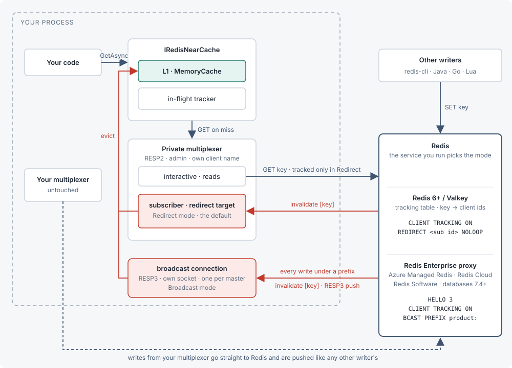

<div align="center">
  
  <h1>RedisNearCache</h1>
  <p><strong>Client-side caching on top of StackExchange.Redis. Keeps the values you read in memory and drops them the moment Redis says they changed.</strong></p>
  <p>
    <a href="https://github.com/magna-nz/redis-near-cache/actions/workflows/ci.yml"></a>
    <a href="https://www.nuget.org/packages/RedisNearCache"></a>
    <a href="https://dotnet.microsoft.com/"></a>
    <a href="https://redis.io/docs/latest/develop/clients/client-side-caching/"></a>
    <a href="LICENSE"></a>
  </p>
  <p>
    <a href="https://magna-nz.github.io/redis-near-cache/#enterprise"></a>
    <a href="#authentication"></a>
  </p>
  <p><a href="https://magna-nz.github.io/redis-near-cache/">Documentation</a></p>
</div>

<br />

Redis 6 can tell a client when a key it has read changes. RedisNearCache uses that to
keep a local copy of what you read: a hit is served from memory, and a write from anywhere evicts the copy a
few milliseconds later. It is a package you add next to StackExchange.Redis, not a replacement for it: your existing multiplexer
keeps doing everything it does today, and RedisNearCache opens one extra connection for the tracked reads.

Redis added this in version 6 back in 2020. StackExchange.Redis [never picked it up](https://github.com/StackExchange/StackExchange.Redis/issues/1461),
and the 3.x rewrite still ships without it. Rather than fork the library, RedisNearCache sits on top of it: a
second connection that it owns does the tracking, and your existing one keeps working exactly as before.

RedisNearCache is for code that already runs on StackExchange.Redis.

<div align="center">
  
  <br />
  <sub><strong>Only reads that go through the cache are tracked.</strong> Writes can come from anywhere.</sub>
  <br />
  <sub>One invalidation channel or the other, decided by the server you run: <code>Redirect</code> by default,
  <a href="https://magna-nz.github.io/redis-near-cache/#enterprise"><code>Broadcast</code></a> on Redis Enterprise-based services.</sub>
</div>

<br />

More in the [documentation](https://magna-nz.github.io/redis-near-cache/), including the sequence diagrams,
the reconnect model and the API reference.

## Install

```sh
dotnet add package RedisNearCache
```

Add `RedisNearCache.HybridCache` as well if you want it behind `HybridCache` or `IDistributedCache`.

## Use

Redis or Valkey reached directly (self-hosted, ElastiCache node-based, Azure Cache for Redis):

```csharp
services.AddRedisNearCache("localhost:6379");
```

Redis Enterprise-based services (Azure Managed Redis, Redis Cloud, Redis Software), whose proxy needs
[broadcast mode](https://magna-nz.github.io/redis-near-cache/#enterprise):

```csharp
services.AddRedisNearCache("my-cache.region.redis.azure.net:10000,ssl=true,password=<access-key>", o =>
{
    o.TrackingMode = TrackingMode.Broadcast;   // default is Redirect, for Redis reached directly
    o.KeyPrefixes.Add("user:");                 // invalidations are broadcast per prefix, so set one
});
```

Everything after registration is the same in both modes.

```csharp
var cache = provider.GetRequiredService<IRedisNearCache>();
await cache.Ready;                                     // subscription up, tracking armed on every master

var user = await cache.GetAsync<User>("user:42");      // miss: one GET, tracked, stored locally
var again = await cache.GetAsync<User>("user:42");     // hit: no network call
var users = await cache.GetManyAsync<User>(["user:1", "user:2", "user:3"]);   // misses share a round trip (256 keys at a time), hits are served locally

await cache.SetAsync("user:42", user with { Name = "Ada" });   // writes through, evicts the local copy
var created = await cache.SetAsync("user:42", user, When.NotExists);   // StackExchange.Redis.When: write only if absent; false if it exists
Console.WriteLine(cache.Statistics);                   // hits=1 misses=1 invalidations=0 flushes=0 rearms=0 raceDiscards=0 l1Entries=0
```

Then, from anywhere:

```sh
redis-cli SET user:42 '{"Name":"Grace"}'               # the next GetAsync sees Grace
```

Behind `HybridCache`:

```csharp
services.AddRedisNearCache("localhost:6379");
services.AddRedisNearCacheHybridCache();               // HybridCache's own L1 is disabled; ours is the coherent one
```

### Authentication

Passwords, ACL users, mutual TLS and Entra ID tokens are taken from the `ConfigurationOptions` (or connection
string) you pass in; every connection the cache opens uses them. The `Auth` test suite runs each of these
against real servers (standalone, cluster and Sentinel; Redis 6.2 to 8 and Valkey 8.1; the Redis Enterprise
proxy for passwords):

- **Password or ACL user** (`password=`, `user=`): both tracking modes. A least-privilege ACL for each mode, with
  what every grant is for, is in the [docs](https://magna-nz.github.io/redis-near-cache/#acl-permissions); about
  half of it is what StackExchange.Redis itself needs.
- **Mutual TLS**: in `Redirect`, supply the client certificate however you do for StackExchange.Redis. In
  `Broadcast`, supply it through `ConfigurationOptions.SslClientAuthenticationOptions`: the broadcast connection
  cannot read the `CertificateSelection`/`CertificateValidation` events, and with only those set the cache fails
  loudly at startup and stays in pass-through rather than caching.
- **Sentinel**: the sentinels and the data nodes share the one `Password` StackExchange.Redis has. Sentinels with
  no password in front of password-protected data nodes work; a *different* sentinel password cannot be expressed.
- A wrong or missing credential is an exception at startup, never a cache that silently does not invalidate.

### EntraID Auth

Entra ID authentication (`Microsoft.Azure.StackExchangeRedis`) works in both tracking modes, including in-place
re-authentication of a live `Broadcast` connection when the token rotates: no reconnect, no flush. The test suite
runs the real extension against a local server with a stand-in token credential (there is no Azure tenant in CI), so
what it proves is the mechanism, not the service. Configure `ConfigurationOptions` with the
extension and pass it as `RedisNearCacheOptions.Configuration`:

```csharp
var cfg = ConfigurationOptions.Parse("my-cache.region.redis.azure.net:10000");
await cfg.ConfigureForAzureWithTokenCredentialAsync(new DefaultAzureCredential());   // Microsoft.Azure.StackExchangeRedis

services.AddRedisNearCache(o =>
{
    o.Configuration = cfg;
    o.TrackingMode = TrackingMode.Broadcast;
    o.KeyPrefixes.Add("product:");
});
```

### Key namespaces and named instances

`RedisNearCacheOptions.KeyNamespace` prefixes every key given to the cache, so several applications or tenants can
share one Redis database: with `"app1:"`, `GetAsync("user:42")` reads the Redis key `app1:user:42`.
Pass keys without the namespace from then on; a key that already carries it gets it twice (warned about once).
`AddKeyedRedisNearCache` registers a second (third, ...) `IRedisNearCache`, with its own options, connections, L1
and statistics, resolved by name instead of the default one:

```csharp
services.AddKeyedRedisNearCache("sessions", connectionString, o => { o.KeyNamespace = "sessions:"; o.L1SizeLimit = 50_000; });

public sealed class Basket([FromKeyedServices("sessions")] IRedisNearCache cache) { /* ... */ }
```

### Metrics and health checks

`IRedisNearCache.Statistics` and a `System.Diagnostics.Metrics` meter (`RedisNearCacheStatistics.MeterName`) expose the
same counters, plus L1 entry count and coherence as gauges, tagged with each instance's Redis client name. A health
check reports `Degraded` (not `Unhealthy`) while the cache is in pass-through, since reads still succeed straight
from Redis.

```csharp
services.AddOpenTelemetry().WithMetrics(m => m.AddMeter(RedisNearCacheStatistics.MeterName));
services.AddHealthChecks().AddCheck<RedisNearCacheHealthCheck>("redis-near-cache");
```

## Performance

20 app instances, 160 readers, and 2,000 writes/s from another service straight to Redis. Redis 7.4 on one machine,
TTL caches set to 10 s.

<!-- HEADLINE -->
| | Reads/s | Reads served stale | Stalest read |
|---|---:|---:|---:|
| **RedisNearCache** | **2.20 M** | **0.33 %** | **105 ms** |
| `IMemoryCache` + 10 s TTL | 14.51 M | 83.1 % | 10.0 s |
| `HybridCache` + Redis L2 | 25.99 M | 84.8 % | 10.0 s |
| FusionCache + backplane | 6.42 M | 85.0 % | 10.0 s |
<!-- /HEADLINE -->

- **Only RedisNearCache stays fresh**: any write from any client evicts the local copy.
- **TTL caches read faster, but served over 80 % of reads stale**, some up to the full 10 s.

**[Full results and methodology →](bench/RedisNearCache.Bench/README.md)** Covers server traffic, latency sweeps,
writes through each library's own API, cluster, TLS, Valkey, chaos, and per-call costs.

## Docs

The quickstart, diagrams, configuration, API reference, HybridCache adapter, operations guide and FAQ live
on the **[documentation site](https://magna-nz.github.io/redis-near-cache/)**.

## Development

```sh
./up.sh                   # every container the tests need (standalone, replica, TLS, cluster, Sentinel, managed-style)
dotnet test tests/RedisNearCache.Tests --filter "Category!=Soak"
bench/run-matrix.sh --quick   # benchmarks, not run in CI; see bench/RedisNearCache.Bench/README.md
```

## License

MIT
